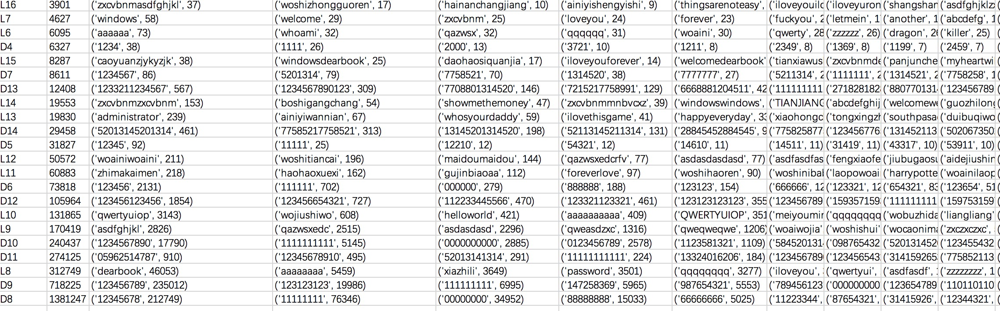

# Web_security
The homework of Web Security

### 0x00 代码结构说明
---
代码匆忙整理了一下, 没有规范输入输出以及函数命名, 注释也写得不够详细, 请见谅!
- data_analysis 数据分析
	* length_count.py 输入yahoopw.csv/csdnpw.csv 输出passwd_length.csv
	* structure_analysis.py 输入yahoopw.csv/csdnpw.csv 输出structure_analysis.csv & onlyLorD_analysis.csv
	* date_analysis 输入yahoopw.csv/csdnpw.csv 输出onlydate_passwd.csv & enDate.csv
- pwdList_generate 字典生成
	* 1000000-top.txt  频率前top1000000的口令
	* 键盘密码分析_v1.txt 键位口令分析
	* nlp_passwd.docx NLP口令分析

### 0x01 总体思路说明
---
0. 预处理：将600w和40w的口令数据分别随机分成两份, 一份用来做测试集, 一份用来做训练集
1. 根据数据分析结果生成弱口令/常用口令字典, 用于筛选口令强度低的用户
2. 将比对过滤后的口令强度高的用户名取出生成新的文件
3. 对于剩下的用户名, 取出其用户名中的特征, 并据此生成n个密码测试(对于可检测度高的用户名 可额外猜测)(*Yahoo和csdn需要分开生成,csdn可以加入程序员常用词汇)
4. 最后统计猜测准确率 = 猜中的口令数量/整个词典大小

### 0x02 数据分析思路与结论
---
* 口令长度规律分析(/data_analysis/length_count.py)    
  统计所有口令的长度, 找出占比最高的口令长度, 作为生成字典的主要长度    
  结果如下:   
  
    

  ps: 口令的最大长度为40, print了一下长度为40的字符串, 无法正常显示, 应该是中文密码   
  pps: 顺便查了下有没有sql注入的密码, 只找到一个 '1=1' && 'yn'  嘻嘻   
  ppps: 图好像画错了, 两个都是8位最多, 我明天重画一个...   
   
  
* 口令结构分析    
  口令可以由数字、字母、字符组成，分别由D(digit)、L(letter)、S(signel)表示   
  在程序中遍历所有口令,识别其结构,以LxDxSx的格式存储(x为长度), 比如
  > woaini777  ->  L6D3

  ps: 使用了python自带的c.isdigit() isalpha() 判断字母和数字    

  **输出文件1** : 口令结构与对应数量

  | structure | nums |
  | ------ | ------ |
  | L5D2 | 8704 |

  结论:    
  yahoo的口令文件中L6,L7,L8分别占据1、2、3名, 数量为42234,34285,30250, 这三者的占比达到了总数量453490条的23.5%   
  csdn的口令文件中D8,D9,L8分别占据1、2、3名, 数量为1381247,718225,312749, 这三者之和为2412221, 占总数量6428631的37.5%   
  由于csdn是国内的网站, Yahoo属于国际性的网站, 可以从结果中看出国内的网民更偏向于用数字作为密码, 而国外网民可能更偏向于用字母作为密码[1]
   
  
  **输出文件2**: 纯数字/字母/字符口令数量以及使用频率top10    
  
  | structure | nums | 1 | 2 ...|   
  | ------ | ------ |------| ------ |   
  | L8 | 8704 | sksssss:100| xxxxxxxx:100|

  yahoo结果:   
    
  
  csdn结果:   
    
  
  还有些奇怪的东西:     
    
  
  @@@ 还没做的: 统计使用两种字母/数字/字符其中两种结合的, 三种结合的用户数量, 测评密码的安全度 / 判断小写大写字母的数量  
   

* 日期格式口令分析   
  首先对纯数字组成的日期进行分析, 按照习惯, 有可能出现年份(yyyy), 年份-月份(yyyymm) , 年月日(yyyymmdd) 以及
  月日(mmdd)这四种主要形式   
  日期我们限定在正常日期(年份取近现代史1700-2100,月取01-12,日期取01-31)内, 然后对所有口令进行正则判断, 得到以下结果:

  - yahoo:   
  
    | yyyy |  yyyy-mm |  yyyy-mm-dd | mm-dd |   
    |------|------|------|------|   
    | 26995 | 829 | 285 | 21712 |
    
	所有数字长度大于4的口令数量为96742, 而含有(形似)日期数字的口令数量总共有49821条, 占51.5%, 占总口令数量的10.9%
	而对含英文日期的口令进行检测(如Jan\Feb……), 只占756条
	纯日期组成：1565

  - csdn:(国内网民更偏向于用数字作为密码)   
  
    | yyyy |  yyyy-mm |  yyyy-mm-dd | mm-dd |   
    |------|------|------|------|   
    | 1653148 | 669045 | 583023 | 1824891 |
    
	所有数字长度大于4的口令数量为5038597,含有(形似)日期数字的口令数量为4730107, 占93.9%, 占总口令数量的73.6%
	含英文组成的日期比yahoo还要少, 只有611条(可能因为国内网民不习惯用英文日期)
	纯日期组成：519827

   字典生成思路: 穷举某个时间段内的所有日期(不要穷举所有可能组合)     
   @@@  新思路:  还有960625这种日期密码没有考虑到
       
   
* 拼音格式口令分析

  两个思路：
  1. 生成一个含有拼音与频率对应的词典, 根据拼音的频率决定匹配方式   
  	 链接: https://blog.csdn.net/beibei8080/article/details/53508996
  2. 通过拼音流划分来提取字符串中的拼音    
  	 链接: https://wenku.baidu.com/view/448e5a21ec3a87c24128c42d.html

  我暂时写了个贪婪的匹配方法, 思路与2类似, 但由于还需要考虑和英文单词的交集, 所以暂时还不太准确    
       
  
* 英文单词口令分析

 

### 0x03 字典生成思路
---
* PCFG   
  **CFG**指的是上下文无关文法, 在解析某个特定的句子时它可以被抽象的认为是一个语法树, 比如:    
        
  而CFG的问题在于, 对于一个输入的句子而言, 可能会有多种不同的解析结果, 在这种情况下, CFG无法识别哪一种结果是用户需要的。    
  > 如: 他要粉蒸肉 -> 他要粉,蒸肉 或 他要,粉蒸肉     
  
  因此, 又提出了**PCFG**(**概率上下文无关文法**)。PCFG在遇到有歧义的解析时, 会根据后面的语法规则出现概率的大小进行选择, 如上面例子中, 粉蒸肉的概率大小为0.2, 蒸肉的概率大小为0.1, 那么会选择前者进行解析。   
  在解析时规则的概率大小可以由经验决定, 但更多的是从训练集中统计而来。可以运用最大似然估计:    
  > P(X -> Y) = count(X->Y)/count(X)    
  
  即在句子X中, 出现Y的概率是多少。    
   
  运用到我们的口令破解字典生成中, PCFG可以被简化为下面的情况:[6]      
  >一条口令可能由字母(L)、数字(D)、符号(S)组成, 如lsy960625!@#就可以被切分为L3:'lsy'和D6:'960625'以及S3:'!@#', 那么此时, 我们的语法规则就可以设定为这些字段的组合顺序, 在当前情况下, 顺序为L3D6S3, 那么顺序还有可能是L3D8S1, D8等等。    
  口令模式(LxDxSx)是我们需要判断的语法规则, 同时L6指代的究竟是哪一串数字同样是我们需要统计的规则。比如模式为L6的字符串里, 'letter'的出现频率为0.1, 'longsy'出现的频率为0.001, 那么在出现L6时候我们将优先选择'letter'。    
  综上, 我们需要根据训练集得到两个概率表, 一个是口令模式串与其概率对应的表, 格式如下:   
  
  | L3S4D5 | 0.02 |
  |------|------|
  | L8D2 | 0.03 |
  |  D8  | 0.1 |     
  
  > 以及一个字符组件的概率表:    
  
  |D3| 123 | 0.02 |
  |------|------|------|
  |D3| 000 | 0.03 |
  |L4|  love  | 0.1 |  
  
  > 根据这两个表, 我们计算'lsy960625,./'这个密码的生成概率为:     
  > P('lsy960625,./') = P(S->L3D6S3) x P(L3->'lsy') x P(D6->'960625') x P(S3->',./')     
  这样我们就能得到每个字符串的生成概率, 并按照这个概率递减排序, 得到我们的猜测集。(这个地方可以引申用户设置密码的时候, 字符种类越多, 密码就越安全的原因)     
  
   
* Markov    
  Markov是唯一一个基本用不到前面结果的方法, 因为它是上下文有关的方法。      
  它通过计算一个字符串从左向右的字符之间的联系来计算口令概率, 这个需要用到概率论中的一些知识。n阶Markov记录长度为n的字符串后面跟的一个字母频率。    
  我举个简单的例子说明一下, 口令串'lsy123', 2阶、3阶的Markov模型会分别以如下方式计算该口令串的概率:    
  > P('lsy123') = P(l) x P(s|l) x P(y|ls) x P(1|sy) x P(2|y1) x P(12|3)     
  > P('lsy123') = P(l) x P(s|l) x P(y|ls) x P(1|lsy) x P(2|sy1) x P(3|y12)     
  具体P(A|B)怎么计算所有关于Markov链的文章中都有写, 这个还需要自己去看一两篇相关文章。     
       
  因为Markov的计算量随着阶数的升高会迅速增长, 在我们的应用场景下, 计算P(y|ls)的概率和P(12|3)的概率或许很重要, 但对于P(2|y1)这种横跨两种字符段的概率计算却不那么重要。所以我的想法是先对字母、数字、字符划分开来做Markov, 以及这三者的前后关系也可以用Markov计算, 而不去考虑两种字符混在一起时的概率。这个做完以后如果有时间, 再去算一些字母和数字还有字符组合的概率, 比如'P01son', 它代表着poison这个英文单词, 但是是由两种字符组成的。     
  Markov其实并不难理解, 只是用到了一些概率论知识, 一定要找相关文章和代码结合着看, 还是很容易理解的。
  
  
   
* NLP    
  NLP主要是对口令深层次语义的分析, 比如在PCFG设定的框架内(LxDxSx), 如何识别每一个字符段的含义, 并且根据其含义统计出用户组合口令的习惯。    
  举几个个例子:    
  > woaini123      
  > lsy960625     
  > computer      
  
&emsp;&emsp;在上面三个密码中, 第一个的结构为L6S3, 而通过对字符串的统计分析, 可以知道L6为一串拼音, S3为一串键盘密码, 那么此时我们就得到了它的组合方式。但只知道这一点还不够, 每个用户选择的L6与S3串可能会不同, 那么究竟是什么促使他们做出这样的选择呢? 这就要靠对这两串字符的语义分析。网上有很多做拼音和汉字转换的词库, 可以通过将拼音转换为汉字再做词性标注, 得到这个字符串的词性应该是 主谓宾, 那么此时将主谓宾作为一条可能出现的规则添加到字典中, 之后的分析每出现一次频率加1, 以这样的方式去统计整个字典, 得出一套训练模型。     
&emsp;&emsp;对于第二条来说, lsy可能是英文缩写, 而后面则是日期密码, 这也是一种组合规则, 第三条则是英文, 英文的词性标注已经比较成熟了, 这个还算简单一些。    
&emsp;&emsp;上面都是我的一些想法, NLP可以做的很好, 但是也可以只做最基本的(比如英文的词性标注这些), 看时间来吧～     
&emsp;&emsp;**PCFG和NLP的结合点**在于, PCFG将字符串划分为多个字符段并计算概率, 而NLP则是对单个的字符段进行语义分析, 两者的划分相同, 但是计算概率的方法不同。前者只是简单的统计分析, 后者则是更深层次的模型训练。

    

### 0x04 准确率评估    
---  
&emsp;&emsp;准确率的评估应该由:**成功破解该用户口令需要的次数** 来决定     
&emsp;&emsp;而转换到我们的情况就是, 对于某个口令, 使用我们生成的字典需要猜测多少次才能命中。      
&emsp;&emsp;这要求我们对生成的口令字典做一个排序, 比如'123456'这个口令的频率最高, 那么它的rank就为1, '123456789'频率第二, 它的rank就为2, 如此对字典中的所有口令都进行排序。     
&emsp;&emsp;在猜测时, 我们根据rank从高到低(从1到x)的顺序对所有待破解的口令进行遍历, 第一次破解采用rank=1的口令, 找出所有等于'123456'的口令, 并把它们的破解次数记录为1, 第二次破解采用rank为2的口令, 把所有命中的口令破解次数记录为2, 如此继续下去, 一直猜测到所有我们生成的口令用完为止(或我们根据猜测次数n动态的生成口令集)。     
&emsp;&emsp;这样做的好处是, 更加容易计算在猜测次数限制为n的情况下, 字典命中率有多高。如假设猜测次数限制为100, 那么我们将所有破解次数记录小于等于100的口令数量计算出来, 除以总口令数量, 就可以得到100次数内, 命中率为多高。      
&emsp;&emsp;这种方法也是评价口令安全强度常用的方法之一。

 

### 0x05 参考文献
---
[1] Bornmann L, Leydesdorff L. Skewness of citation impact data and covariates of citation distributions: A large-scale empirical analysis based on Web of Science data[J]. Journal of Informetrics, 2016, 11(1):164-175.     
   这篇文章讲了数据分析的一些方法, 并且用PCFG生成了含有拼音的字典 
[2] Ur B, Segreti S M, Bauer L, et al. Measuring real-world accuracies and biases in modeling password guessability[C]// Usenix Conference on Security Symposium. USENIX Association, 2015:463-481. 
   这篇文章论述了密码安全强度的评价, 以及不同的字典生成方法的攻击成功率 
[3] Melicher W, Ur B, Segreti S M, et al. Fast, Lean, and Accurate: Modeling Password Guessability Using Neural Networks[J]. Journal of Networks, 2013, 8(6). 
   主要讲了如何用神经网络提升对密码安全评级的准确性(其中包含了对Markov等方法的评价,但可能没讲方法) 
[4] Golla M, Dürmuth M. On the Accuracy of Password Strength Meters[C]//Proceedings of the 2018 ACM SIGSAC Conference on Computer and Communications Security. ACM, 2018: 1567-1582. 
   该文章比对了各种密码强度评估准则, 并且衡量了这些准则的准确性 
[5] R. Veras, C. Collins, and J. Thorpe. On the Semantic Patterns of Passwords and their Security Impact.[[C]]//Proceedings of the 2014 Network and Distributed System Security Symposium (NDSS), 2014. 
   该文章讲述了如何对密码进行分割和语义分析 
