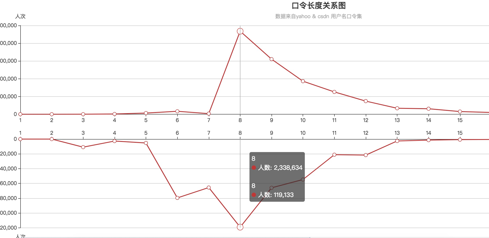
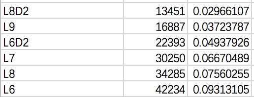
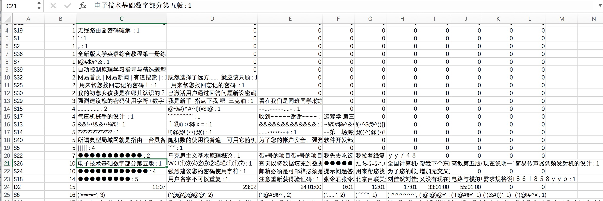

# Web_security
The homework of Web Security

### 0x00 代码结构说明
---
- data_analysis 数据分析
	* length_count.py 输入yahoopw.csv/csdnpw.csv 输出passwd_length.csv
	* structure_analysis.py 输入yahoopw.csv/csdnpw.csv 输出structure_analysis.csv & onlyLorD_analysis.csv
	* date_analysis 输入yahoopw.csv/csdnpw.csv 输出onlydate_passwd.csv & enDate.csv
- pwdList_generate 字典生成
	* 1000000-top.txt  频率前top1000000的口令
	* 键盘密码分析_v1.txt 键位口令分析
	* nlp_passwd.docx NLP口令分析
	* nlp_pw.rar NLP口令分析语料库，及代码

### 0x01 总体思路说明
---
0. 预处理: 将口令数据分为训练集和测试集
1. 对口令数据进行统计、分析、数据可视化
2. 基于第1步以及PCFG/Markov/NLP等方法生成口令字典
3. 统计平均猜测长度或指定猜测次数n下的准确率           

 

### 0x02 数据分析思路与结论
---
#### 1. 口令长度规律分析(length_analysis)       
  * 思路分析: 了解用户偏好的口令长度, 有利于字典的生成
  * 统计方法: 对所有口令进行长度统计划分, 以图表的形式展示       
  * 结果:   
  
    

  

    
备注

    
     
	    ps: 口令的最大长度为40, print了一下长度为40的字符串, 无法正常显示, 应该是中文密码       
	    pps: 顺便查了下有没有sql注入的密码, 只找到一个 '1=1' && 'yn'  :)          
	    ppps: 图好像画错了, 两个都是8位最多, 我重画一个...   
    

  

   
  
#### 2. 口令结构分析(structure_analysis)    
  * 思路分析: 口令由数字、字母、其他字符组成,分别由D(digit)、L(letter)、S(signel)表示, 一段口令的结构形式可如下表示:         
  > woaini777  ->  L6D3             
  * 统计方法: 统计所有的口令结构形式及其出现概率,以及字符子串(如L3)的出现概率,还有纯数字/纯字母的口令TOP10(弱口令集)         
  * 结果:            
           
	   
  **输出文件1** : 口令结构/出现次数/出现概率

  | structure | nums | freq |
  | ------ | ------ |------|
  | L5D2 | 8704 | 0.0005 |
            
  yahoo:          
  
            
  
              
  
           
  
      
  
  结论:    
  yahoo结果中L6,L7,L8占据123名, 数量为42234,34285,30250, 三者占比达到了总量453490条的23.5%   
  csdn结果中D8,D9,L8占据1、2、3名, 数量为1381247,718225,312749, 这三者之和为2412221, 占总数量6428631的37.5%   
  csdn国内用户较多,Yahoo属于国际性网站,可以从结果看出国内网民更偏向于用数字作为密码, 而国外网民更偏向于用字母作为密码[1]
   
  
  **输出文件2**: 纯数字/字母/字符口令数量以及使用频率top10    
  
  | structure | nums | 1 | 2 ...|   
  | ------ | ------ |------| ------ |   
  | L8 | 8704 | sksssss:100| xxxxxxxx:100|

  yahoo:   
    
  
  csdn:   
    
  
  还有些奇怪的东西:     
    
              
  **输出文件3**: 字符子串及其出现次数       
  
  | structure_str | 1 | 2... |
  | ------ | ------ |------|
  | L8 | password-1275 | sunshine-350 |           
              
  该文件主要用于PCFG等字典生成方法计算概率用, 以"-"作为字符串和出现频数的分割
  
   

#### 3. 日期格式口令分析   
  * 思路分析: 日期密码可能出现年份(yyyy), 年份-月份(yyyymm) , 年月日(yyyymmdd/mmddyyyy/ddmmyyyy/yymmdd/mmddyy/ddmmyy)以及
  月日(mmdd)这四种主要形式        
  * 统计方法: 日期我们限定在正常日期(年份取近现代史1700-2100,月取01-12,日期取01-31)内, 然后对所有口令进行正则判断, 得到以下结果:

  - yahoo:   
  
    | yyyy |  yyyy-mm | mm-dd | yyyy-mm-dd | yy-mm-dd| mm-dd-yyyy| mm-dd-yy| dd-mm-yyyy |dd-mm-yy |
    |------|------|------|------|------| ------| ------| ------| ------|    
    | 20484 | 304 | 7991 | 285 | 4393 | 1285 | 7084 | 582 | 1423 |
    
    所有数字长度大于4的口令数量为96742, 其中日期口令占43831条, 占总口令数量453490的 9.67%。          
              
      

  - csdn:(国内网民更偏向于用数字作为密码)   
  
    | yyyy |  yyyy-mm | mm-dd | yyyy-mm-dd | yy-mm-dd| mm-dd-yyyy| mm-dd-yy| dd-mm-yyyy |dd-mm-yy |
    |------|------|------|------|------| ------| ------| ------| ------|    
    | 624092 | 44861 | 149535 | 583023 | 875020 | 25419 | 175151 | 15372 | 119137 |
    
    所有数字长度大于4的口令数量为5038597, 日期密码占2611610, 占总口令数量6428631的 40.6%           
                  
      
       
   
   
#### 4. 拼音格式口令分析

  两个思路：
  1. 生成一个含有拼音与频率对应的词典, 根据拼音的频率决定匹配方式   
  	 链接: https://blog.csdn.net/beibei8080/article/details/53508996
  2. 通过拼音流划分来提取字符串中的拼音    
  	 链接: https://wenku.baidu.com/view/448e5a21ec3a87c24128c42d.html

  我暂时写了个贪婪的匹配方法, 思路与2类似, 但由于还需要考虑和英文单词的交集, 所以暂时还不太准确    
       
  
#### 5. 英文单词口令分析         
   英文单词  
    
#### 6. 键盘格式口令分析

  * 注：code: analyze_keyboard_pass_v1.py (version 1)  
   读取文件: yahoopw.csv, csdnpw.csv  
   写文件（字典列表）: result_yahoo_v2.csv, result_csdn_v2.csv  
  * current work:  
    （1） 相比起v1版本，多定义了6种键盘密码模式，分析结果显示：      
    > a.CSDN键盘密码结果集大约增加了8000条新的键盘密码  
     b.YAHOO数据集中大约增加了1000多条新的密码    
     c.新增加的键盘密码相比起v1版本中更为少见，对结果影响不算太大    
     
    （2） 在分析结果中移除了单字母与数字，增加分析结果的准确性  
    （3）只选取了出现频率较高的键盘密码  
	>a.在CSDN数据文件中只选取出现次数高于20次的键盘密码   
	b.在YAHOO数据文件中只选取出现次数高于10次的键盘密码  
	 
    （4）照“密码-出现次数-出现频率”的格式将结果写入结果文件      
    
  * 分析结果（截取前十位）  
  （1）CSDN数据集分析结果前十位  

| order | password |  numbers  | probability|
|-------|----------|-----------|------------|
|   1   |123456789 |   235012  | 0.47194292 |  
|   2   |12345678  |   212749  | 0.427235138|  
|   3   |1234567890|   17790   | 0.035725259|  
|   4   |987654321 |    5553   | 0.011151341|  
|   5   |1qaz2wsx  |    3667   | 0.007363942|  
|   6   |87654321  |    3281   | 0.00658879 | 
|   7   |qwertyuiop|    3143   | 0.006311663|  
|   8   |asdfghjkl |    2826   | 0.005675075|  
|   9   |qazwsxedc |    2515   | 0.005050535|  
|  10   |123456    |    2131   | 0.0042794  |  

统计图如下：  
  

（2）yahoo数据集分析结果前十位   
 
| order | password |  numbers  | probability|
|-------|----------|-----------|------------|
|   1   |123456    |    1673   | 0.507123371|  
|   2   |123456789 |     226   | 0.068505608|  
|   3   |12345678  |     208   | 0.063049409|  
|   4   |qwerty    |     172   | 0.052137011|  
|   5   |1234567   |     110   | 0.033343437|  
|   6   |654321    |     88    | 0.02667475 | 
|   7   |12345     |     78    | 0.023643528|  
|   8   |1qaz2wsx  |     58    | 0.017581085|  
|   9   |1234567890|     47    | 0.014246741|  
|  10   |1234      |     45    | 0.013640497|   

统计图如下:  
        
     
    
   
### 0x03 字典生成思路
---
* PCFG   
  **CFG**指的是上下文无关文法, 在解析某个特定的句子时它可以被抽象的认为是一个语法树, 比如:    
        
  CFG的问题在于对于一个句子而言可能存在多种不同的解析结果, 在这种情况下, CFG无法识别哪种结果是用户需要的。    
  > 如: 他要粉蒸肉 -> 他要粉,蒸肉 或 他要,粉蒸肉     
  
  因此, 又提出了**PCFG**(**概率上下文无关文法**)。PCFG在遇到有歧义的解析时, 会根据后面语法规则出现概率的大小进行选择, 如上例中, 粉蒸肉的概率大小为0.2, 蒸肉的概率大小为0.1, 那么会选择前者进行解析。   
  在解析时规则的概率大小可以由经验决定, 但更多的是从训练集中统计而来。可以运用最大似然估计:    
  > P(X -> Y) = count(X->Y)/count(X)    
      
   
  运用到我们的口令破解字典生成中, PCFG可以被简化为下面的情况:[6]      
  >一条口令如'lsy960625!@#'可以被切分为L3:'lsy'和D6:'960625'以及S3:'!@#',那么该口令串的出现概率可以表示为:      
  >P('lsy960625,./') = P(S->L3D6S3) x P(L3->'lsy') x P(D6->'960625') x P(S3->',./')        
  
  因此, 我们需要根据训练集得到两个概率表来计算口令出现概率, 其一是口令结构串与其出现概率对应的表:   
  
  | L3S4D5 | 0.02 |
  |------|------|
  | L8D2 | 0.03 |
  |  D8  | 0.1 |       
         
  以及一个字符子串的概率表:    
  
  |字符结构| 口令串 | 出现概率 |
  |------|------|------|
  |D3| 000 | 0.03 |
  |L4|  love  | 0.1 |  
           
  结果: 分别生成了出现概率最高的top100、1000、5000的口令串, 组成口令破解字典
  
    
  
   
* Markov    
  Markov是唯一一个基本用不到前面结果的方法, 因为它是上下文有关的方法。      
  它通过计算一个字符串从左向右的字符之间的联系来计算口令概率, 这个需要用到概率论中的一些知识。n阶Markov记录长度为n的字符串后面跟的一个字母频率。    
  我举个简单的例子说明一下, 口令串'lsy123', 2阶、3阶的Markov模型会分别以如下方式计算该口令串的概率:    
  > P('lsy123') = P(l) x P(s|l) x P(y|ls) x P(1|sy) x P(2|y1) x P(12|3)     
  > P('lsy123') = P(l) x P(s|l) x P(y|ls) x P(1|lsy) x P(2|sy1) x P(3|y12)     
  具体P(A|B)怎么计算所有关于Markov链的文章中都有写, 这个还需要自己去看一两篇相关文章。     
       
  因为Markov的计算量随着阶数的升高会迅速增长, 在我们的应用场景下, 计算P(y|ls)的概率和P(12|3)的概率或许很重要, 但对于P(2|y1)这种横跨两种字符段的概率计算却不那么重要。所以我的想法是先对字母、数字、字符划分开来做Markov, 以及这三者的前后关系也可以用Markov计算, 而不去考虑两种字符混在一起时的概率。这个做完以后如果有时间, 再去算一些字母和数字还有字符组合的概率, 比如'P01son', 它代表着poison这个英文单词, 但是是由两种字符组成的。     
  Markov其实并不难理解, 只是用到了一些概率论知识, 一定要找相关文章和代码结合着看, 还是很容易理解的。
  
  
   
* NLP       
  基于NLP的口令分析思路
  1. 先建立一个语料库，这个语料库根据COCA，名字，月，城市等等的使用频率生成

  2. 获得口令最有可能的断词方式，把口令断开成为所有子段，根据上述语料库计算不同分段方式的得分，根据得分确定口令句式，如anyonejack断成[anyone, jack]还是[any,one, jack]，生成口令句式。

  3. 对断开的口令进行词性分析，如果口令中包含名字，月，城市等常用类别，则单独标记为name，month，country，其他的调用ntlk.pos_tag即可。如[(anyone, noun), (jack, name)] （目前刚完成到这里）

  4. 统计口令的常用句式
  
  5. 对生成的词性结果进行泛化，如吃米饭泛化为吃食物，这样可以对密码预测时，提供思路。

  6. 生成口令语义预测机         
  
&emsp;&emsp;**PCFG和NLP的结合点**在于, PCFG将字符串划分为多个字符段并计算概率, 而NLP则是对单个的字符段进行语义分析, 两者的划分相同, 但是计算概率的方法不同。前者只是简单的统计分析, 后者则是更深层次的模型训练。

    

### 0x04 准确率评估    
---  
&emsp;&emsp;准确率的评估应该由:**成功破解该用户口令需要的次数** 来决定, 两种计算方法:        
&emsp;&emsp;平均猜测长度
&emsp;&emsp;指定猜测次数n下的准确率       

 

### 0x05 参考文献
---
[1] Bornmann L, Leydesdorff L. Skewness of citation impact data and covariates of citation distributions: A large-scale empirical analysis based on Web of Science data[J]. Journal of Informetrics, 2016, 11(1):164-175.     
   这篇文章讲了数据分析的一些方法, 并且用PCFG生成了含有拼音的字典 
[2] Ur B, Segreti S M, Bauer L, et al. Measuring real-world accuracies and biases in modeling password guessability[C]// Usenix Conference on Security Symposium. USENIX Association, 2015:463-481. 
   这篇文章论述了密码安全强度的评价, 以及不同的字典生成方法的攻击成功率 
[3] Melicher W, Ur B, Segreti S M, et al. Fast, Lean, and Accurate: Modeling Password Guessability Using Neural Networks[J]. Journal of Networks, 2013, 8(6). 
   主要讲了如何用神经网络提升对密码安全评级的准确性(其中包含了对Markov等方法的评价,但可能没讲方法) 
[4] Golla M, Dürmuth M. On the Accuracy of Password Strength Meters[C]//Proceedings of the 2018 ACM SIGSAC Conference on Computer and Communications Security. ACM, 2018: 1567-1582. 
   该文章比对了各种密码强度评估准则, 并且衡量了这些准则的准确性 
[5] R. Veras, C. Collins, and J. Thorpe. On the Semantic Patterns of Passwords and their Security Impact.[[C]]//Proceedings of the 2014 Network and Distributed System Security Symposium (NDSS), 2014. 
   该文章讲述了如何对密码进行分割和语义分析 
